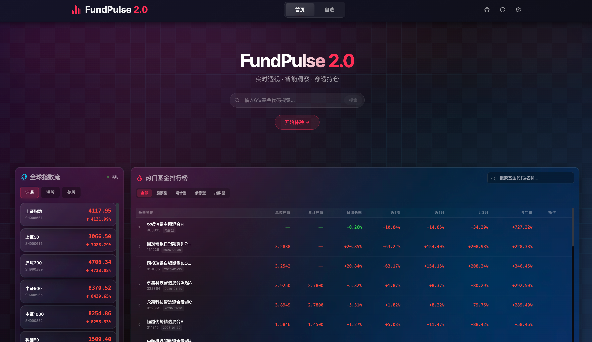
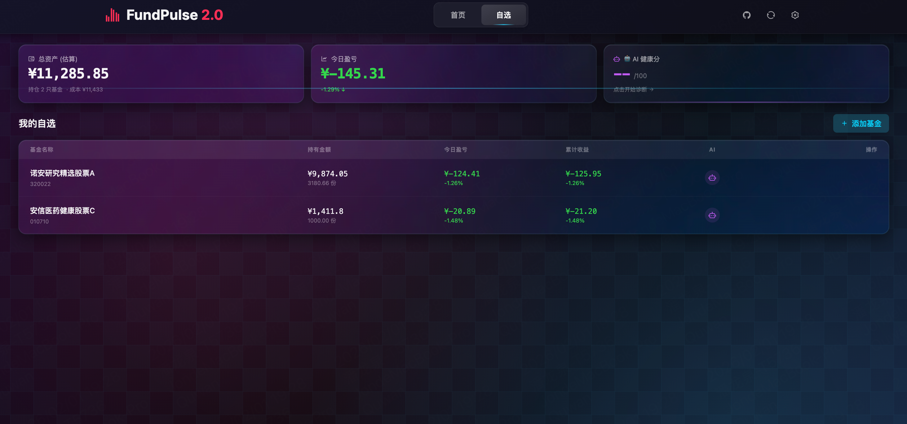
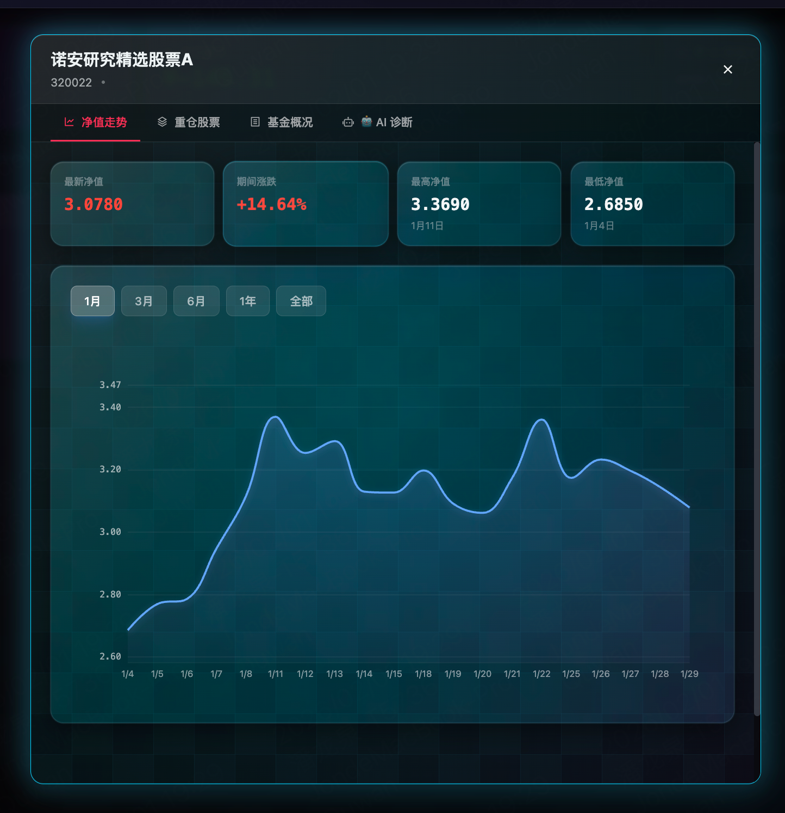
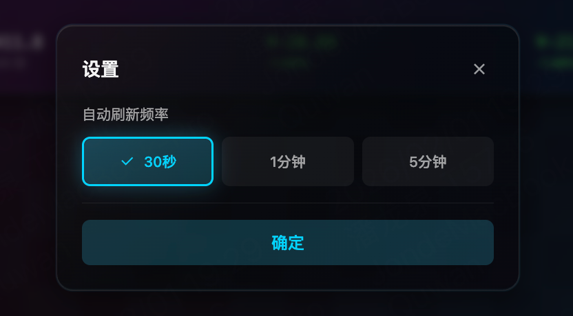

# 📊 FundPulse - 基金净值看板

一个纯浏览器端运行的基金净值追踪 PWA 应用，零后端、全本地存储、即开即用。

## 📸 功能预览

### 首页概览

*实时指数流和热门基金排行榜*

### 自选基金管理

*管理您的基金组合，查看实时收益*

### 基金详情分析

*净值走势图和重仓股分析*

### 设置中心

*自定义刷新频率和偏好设置*

## ✨ 特性

- 🚀 **零后端**：无服务器、无数据库、无用户系统
- 🔒 **隐私优先**：数据完全存储在本地浏览器，不跨设备同步
- 📱 **PWA 支持**：可安装到手机桌面，支持离线访问
- 🎨 **现代 UI**：深空金融主题，玻璃拟态设计
- 📈 **实时数据**：自动刷新基金净值和指数数据
- 📊 **可视化图表**：ECharts 净值走势图，支持多时间范围
- 🏢 **重仓股展示**：查看基金前十大重仓股票

## 🛠️ 技术栈

- **React 18** + **TypeScript**
- **Vite 5** - 构建工具
- **Zustand** - 状态管理
- **Dexie.js** - IndexedDB 封装
- **ECharts** - 图表库
- **Tailwind CSS** - 样式框架
- **RemixIcon** - 图标库

## 📦 安装

```bash
# 安装依赖
npm install

# 启动开发服务器
npm run dev

# 构建生产版本
npm run build

# 预览生产构建
npm run preview
```

## 🎨 PWA 图标

PWA 需要图标文件，请创建以下文件：
- `public/icon-192.png` (192x192)
- `public/icon-512.png` (512x512)

可以使用在线工具生成，或使用设计工具创建。图标建议使用基金/图表相关的图标设计。

## 🎯 使用说明

1. **添加基金**：点击"添加基金"按钮，输入6位基金代码（如：000001）
2. **查看详情**：点击基金卡片查看净值走势图和重仓股信息
3. **切换时间范围**：在图表上方选择 1月/3月/6月/1年/全部
4. **自动刷新**：系统每30秒自动刷新实时数据

## 📝 数据源

- 基金数据：东方财富网（天天基金）
- 指数数据：新浪财经

## 🚀 部署

项目支持多种部署方式：

- **GitHub Pages**：使用 GitHub Actions 自动部署
- **Docker**：容器化部署，支持 Docker Compose
- **Vercel/Netlify**：一键部署到云平台
- **手动部署**：构建后上传到静态文件服务器

详细部署指南请查看 [DEPLOY.md](./DEPLOY.md)

### 快速部署

```bash
# Docker 部署
docker-compose up -d

# 或使用部署脚本
./scripts/deploy.sh docker-run
```

## ⚠️ 免责声明

数据仅供参考，不构成投资建议。市场有风险，入市需谨慎。

## 📄 开源协议

MIT License
